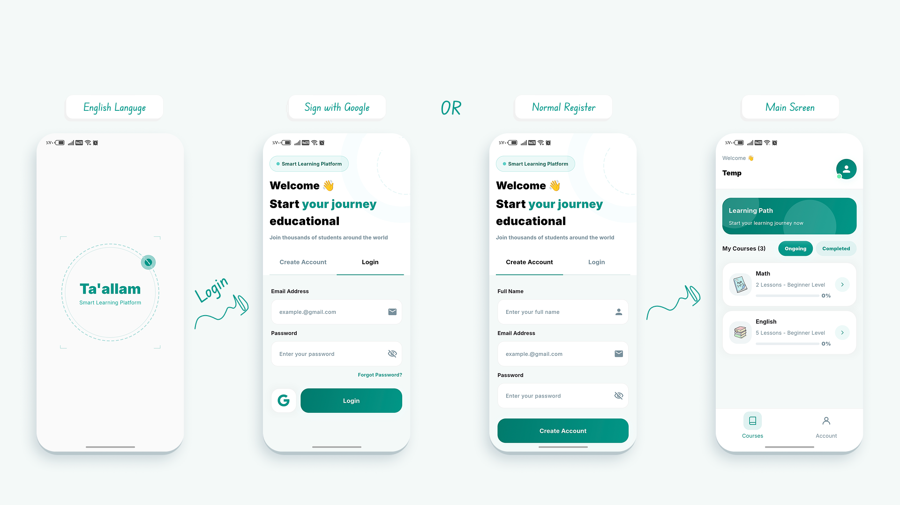
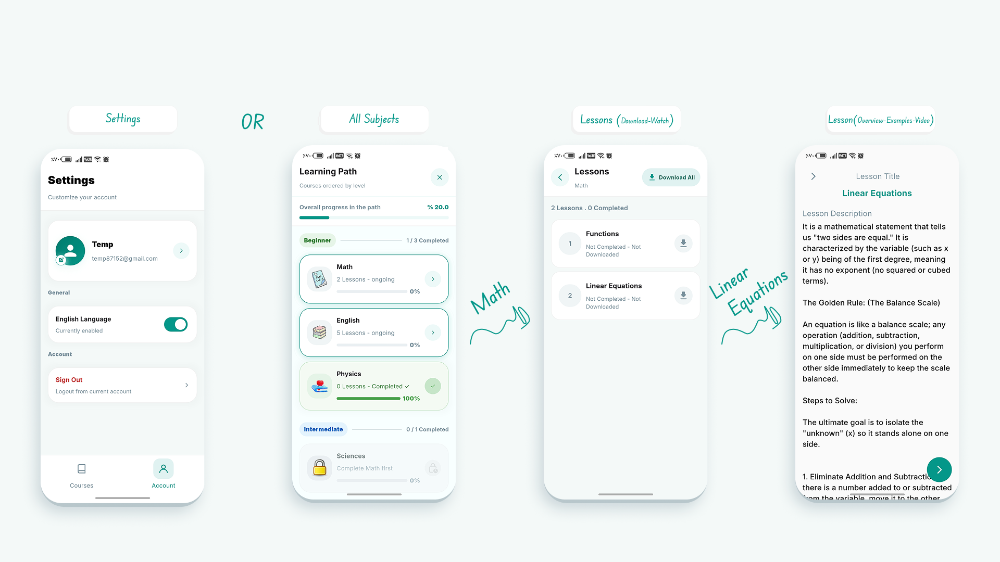
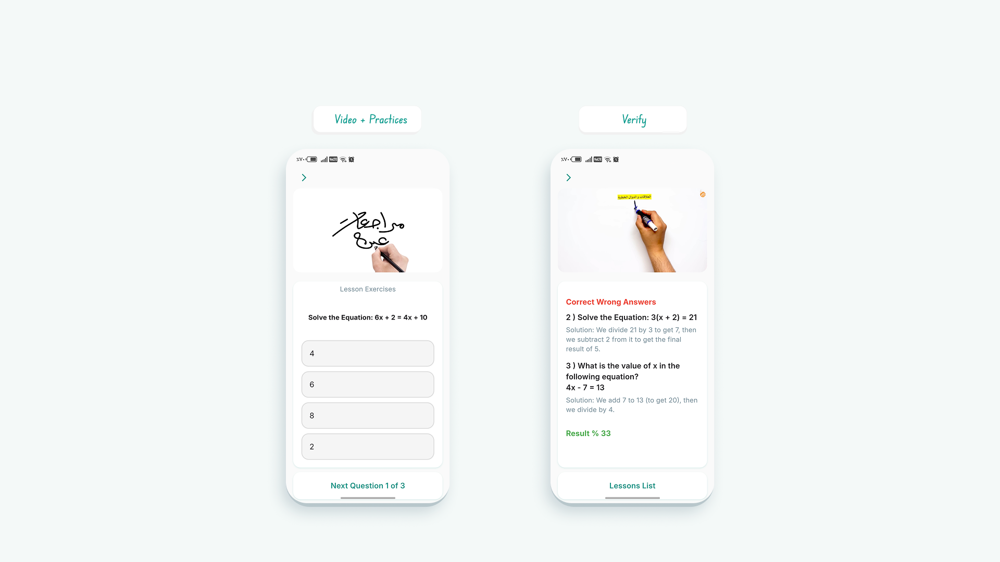
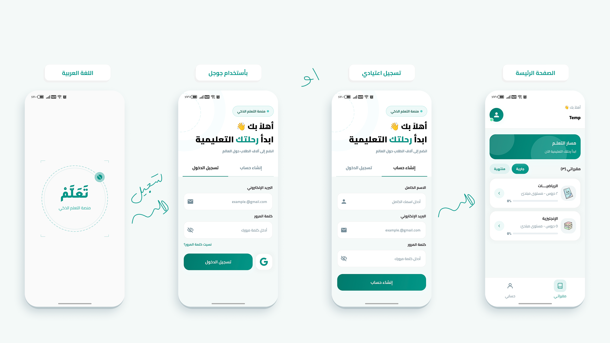
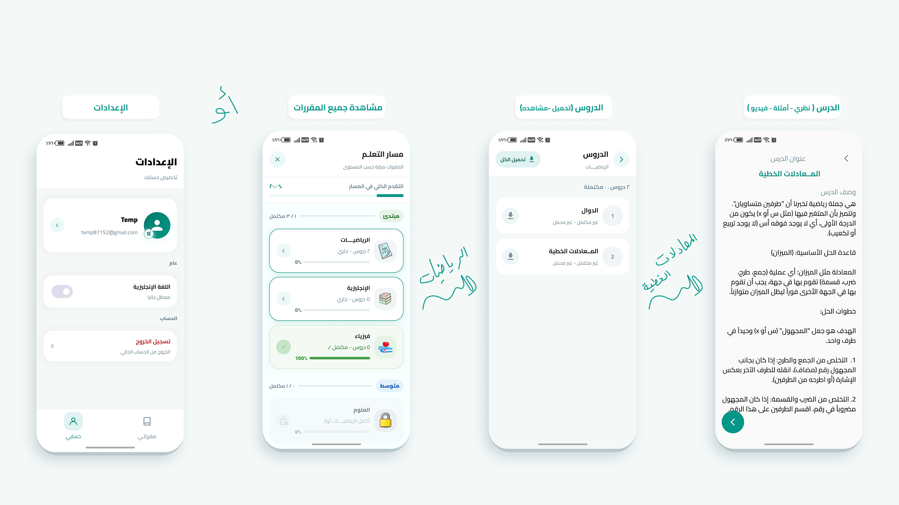
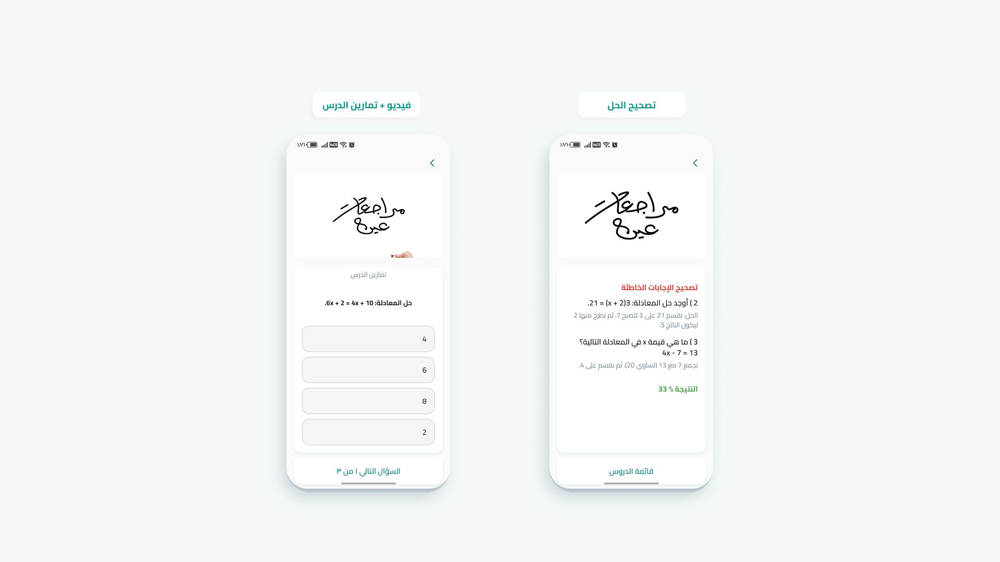

# Ta'allam (تَعَلَّم)

**A smart, all-in-one educational platform designed to give students a flexible and enjoyable learning experience.**

---

## 📖 About the App

Ta'allam is a student's companion throughout their academic journey — combining ease of use with modern e-learning technology, including full offline support for studying anytime, anywhere.

---

## 📸 Screenshots

  

  

**English**

  
  
  

**Arabic**

  
  
  

*(Upload these image files into a `screenshots/` folder in your repo, keeping the exact file names above — including matching capitalization, since GitHub paths are case-sensitive.)*

---

## ✨ Key Features

- **Structured Learning Paths** — Curriculum organized into clear, progressive levels for easier learning
- **Professional Video Lessons** — Engaging, well-explained video content for every topic
- **Offline Access (Smart Downloads)** — Download lessons to watch and study without an internet connection
- **Interactive Quizzes** — End-of-lesson assessments to reinforce understanding and track comprehension
- **Progress Tracking** — Monitor your advancement in each subject independently

---

## ⚙️ Technical Highlights

- **Bilingual Support** — Fully localized interface in both Arabic and English
- **Quick Authentication** — Fast sign-in via email or Google account
- **Modern UI/UX** — Clean, elegant interface designed for a comfortable and intuitive user experience
- **Cloud Sync** — Securely saves and syncs your progress and level across devices

---

## 🚀 Getting Started
*(Add setup/installation instructions here — e.g., prerequisites, how to clone, install dependencies, and run the app)*

## 🛠️ Built With
*(Add your tech stack here — e.g., Flutter, Firebase, Node.js, etc.)*

## 📄 License
*(Add license information here)*